## wallpapers
000000.png
000001.png
000002.png
000003.png
000004.png
000005.png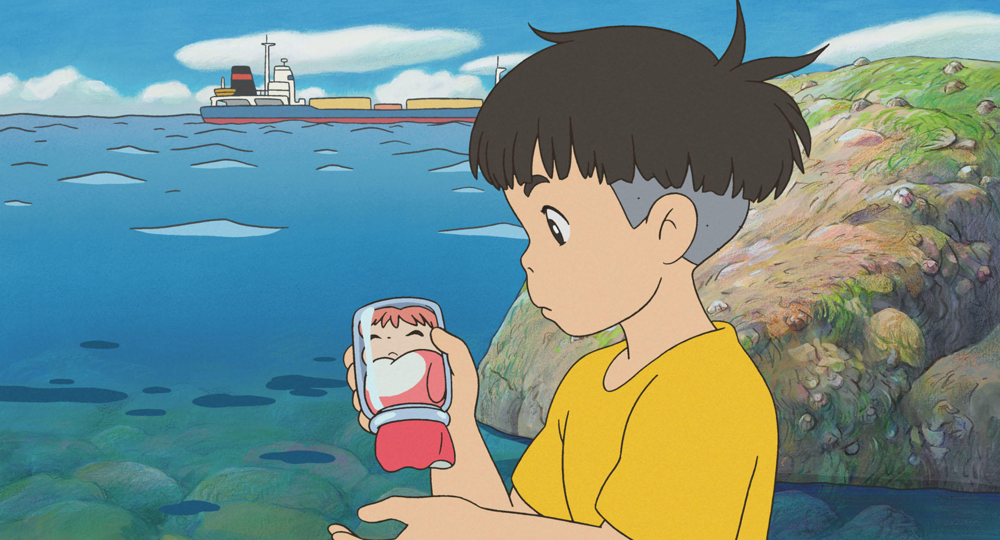
000006.png
000007.png
000008.png
000009.png
000010.png
000011.png
000012.png
000013.png
000014.png
000015.png
000016.png
000017.png
000018.png
000019.png
000020.png
000021.png
000022.png
000023.png
000024.png
000025.png
000026.png
000027.png
000028.png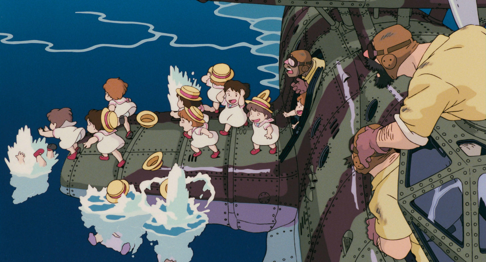
000029.png
000030.png
000031.png
000032.png
000033.png
000034.png
000035.png
000036.png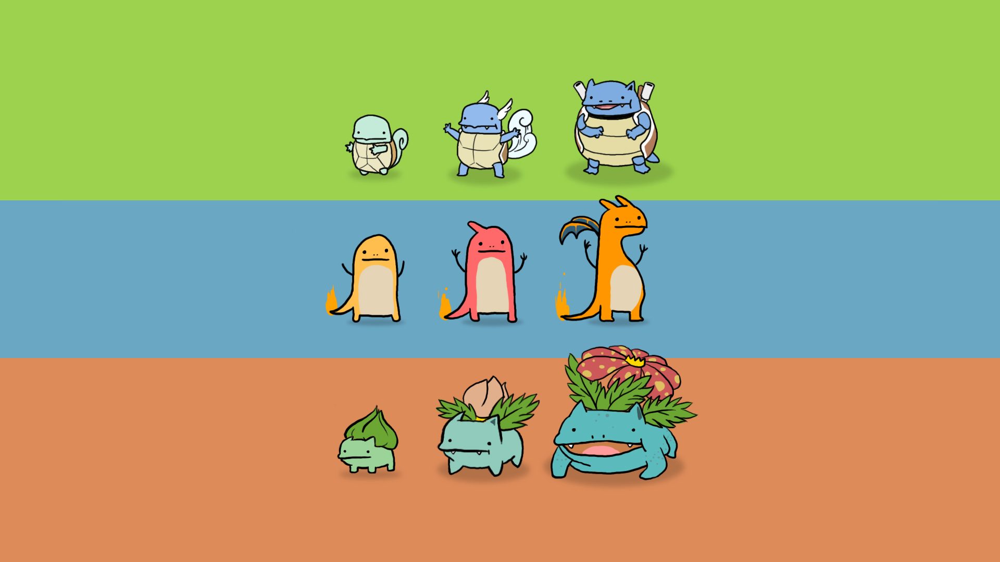
000037.png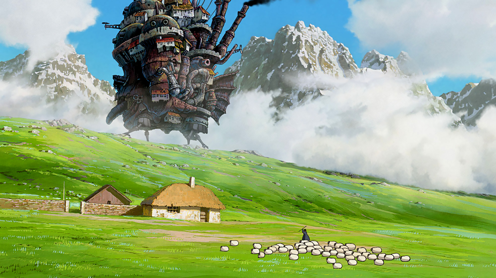
000038.png
000039.png
000040.png
000041.png
000042.png
000043.png
000044.png
000045.png
000046.png
000047.png
000048.png
000049.png
000050.png
000051.png
000052.png
000053.png
000054.png
000055.png
000056.png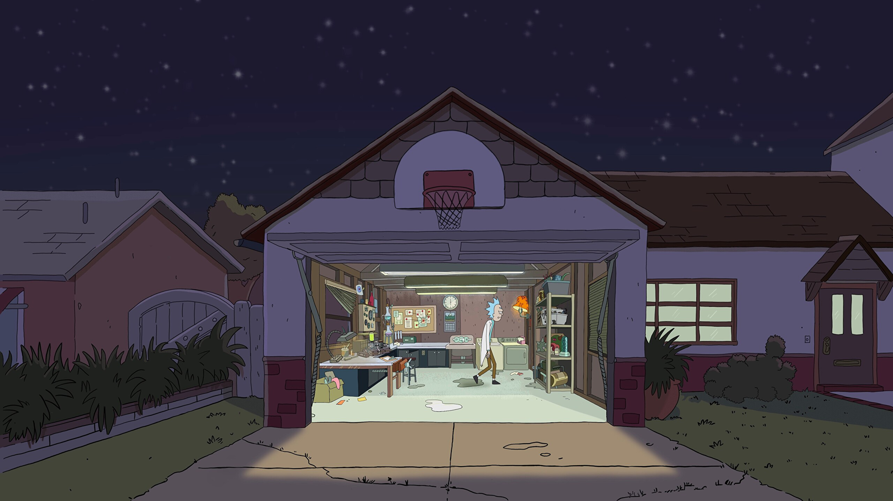
000057.png
000058.png
000059.png
000060.png
000061.png
000062.png
000063.png
000064.png
000065.png
000066.png
000067.png
000068.png
000069.png
000070.png
000071.png
000072.png
000073.png
000074.png
000075.png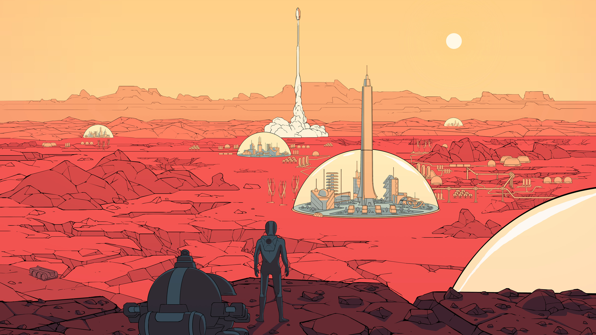
000076.png
000077.png
000078.png
000079.png
000080.png
000081.png
000082.png
000083.png
000084.png
000085.png
000086.png
000087.png
000088.png
000089.png
000090.png
000091.png
000092.png
000093.png
000094.png
000095.png
000096.png
000097.png
000098.png
000099.png
000100.png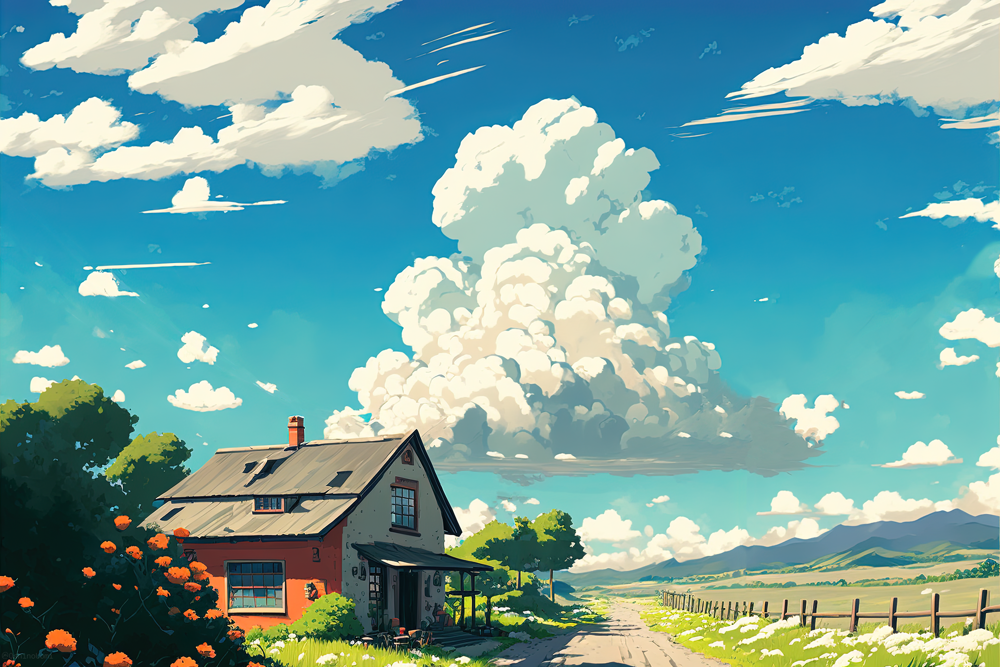
000101.png
000102.png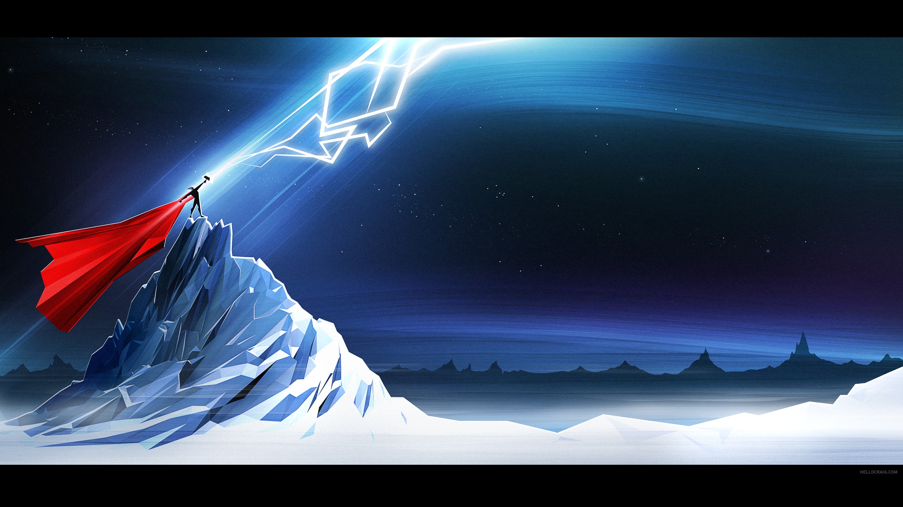
000103.png
000104.png
000105.png
000106.png
000107.png
000108.png
000109.png
000110.png
000111.png
000112.png
000113.png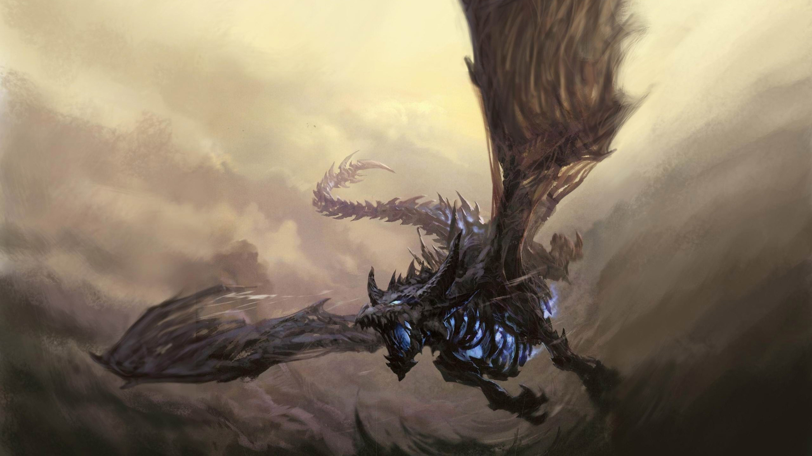
000114.png
000115.png
000116.png
000117.png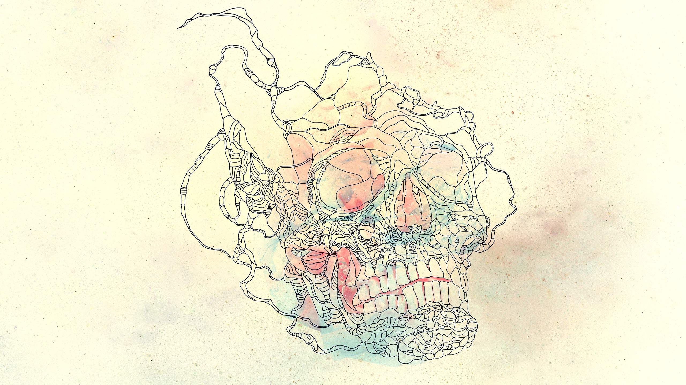
000118.png
000119.png
000120.png
000121.png
000122.png
000123.png
000124.png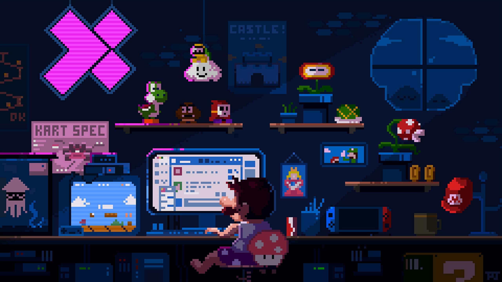
000125.png
000126.png
000127.png
000128.png
000129.png
000130.png
000131.png
000132.png
000133.png
000134.png
000135.png
000136.png
000137.png
000138.png
000139.png
000140.png
000141.png
000142.png
000143.png
000144.png
000145.png
000146.png
000147.png
000148.png
000149.png
000150.png
000151.png
000152.png
000153.png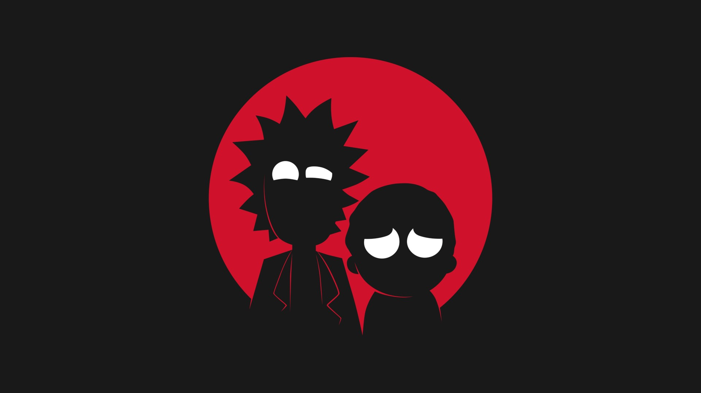
000154.png
000155.png
000156.png
000157.png
000158.png
000159.png
000160.png
000161.png
000162.png
000163.png
000164.png
000165.png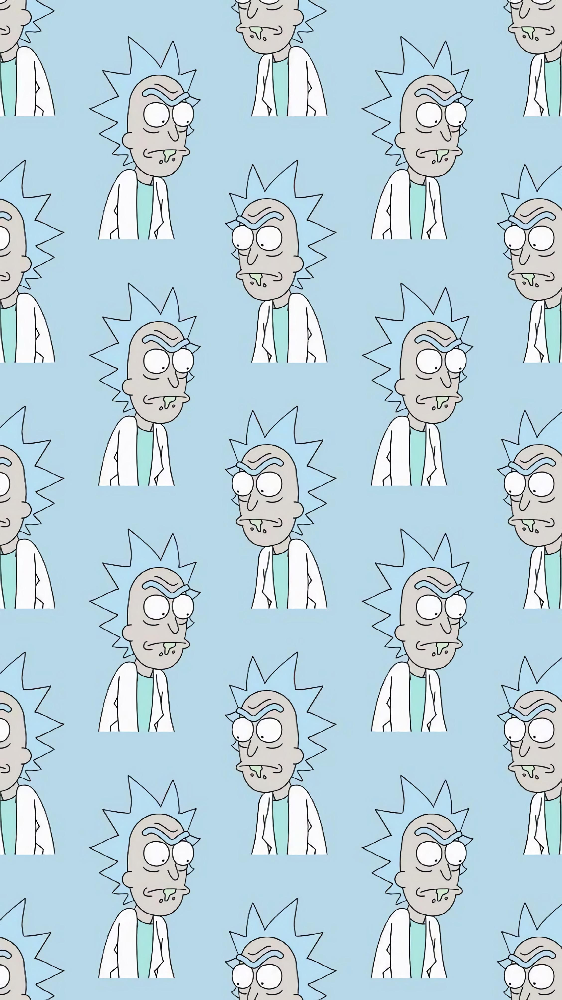
000166.png
